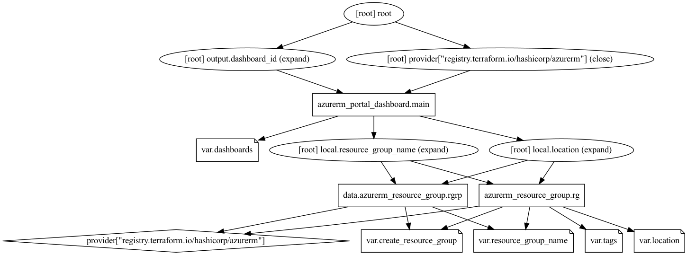

# Azure Dashboard Terraform Module

Dashboards are a focused and organized view of your cloud resources in the Azure portal. Use dashboards as a workspace where you can monitor resources and quickly launch tasks for day-to-day operations.

This terrafrom module quickly deploys multiple dashboards in an Azure resource group using json template files for dashboard definitions.

## Module Usage

```terraform
# Azurerm Provider configuration
provider "azurerm" {
  features {}
}

module "dashboard" {
  source  = "kumarvna/dashboard/azurerm"
  version = "1.1.0"

  # By default, this module will not create a resource group. Location will be same as existing RG.
  # proivde a name to use an existing resource group, specify the existing resource group name, 
  # set the argument to `create_resource_group = true` to create new resrouce group.
  resource_group_name = "rg-shared-westeurope-01"
  location            = "westeurope"

  # Dashboard configuration
  dashboards = [
    {
      name           = "my-cool-dashboard"
      json_file_path = "./test_dashboard.json"
      variables = {
        "title" = "example-dashboard"
      }
    }
  ]

  # Adding TAG's to your Azure resources 
  tags = {
    ProjectName  = "demo-internal"
    Env          = "dev"
    Owner        = "user@example.com"
    BusinessUnit = "CORP"
    ServiceClass = "Gold"
  }
}
```

## `dashboards` - List of Dashboard definitions

The following settings are available for `dashboards` object:

| Name | Description
|--|--
`name`|Specifies the name of the Shared Dashboard. This should be be 64 chars max, only alphanumeric and hyphens (no spaces). For a more friendly display name, add the `hidden-title` tag
`json_file_path`|path of the JSON file data representing dashboard body
`variables`|Variables can be injected as needed for JSON. for example `title`.

## Recommended naming and tagging conventions

Applying tags to your Azure resources, resource groups, and subscriptions to logically organize them into a taxonomy. Each tag consists of a name and a value pair. For example, you can apply the name `Environment` and the value `Production` to all the resources in production.
For recommendations on how to implement a tagging strategy, see Resource naming and tagging decision guide.

>**Important** :
Tag names are case-insensitive for operations. A tag with a tag name, regardless of the casing, is updated or retrieved. However, the resource provider might keep the casing you provide for the tag name. You'll see that casing in cost reports. **Tag values are case-sensitive.**

An effective naming convention assembles resource names by using important resource information as parts of a resource's name. For example, using these [recommended naming conventions](https://docs.microsoft.com/en-us/azure/cloud-adoption-framework/ready/azure-best-practices/naming-and-tagging#example-names), a public IP resource for a production SharePoint workload is named like this: `pip-sharepoint-prod-westus-001`.

## Requirements

| Name | Version |
|------|---------|
| terraform | >= 1.1.9 |
| azurerm | >= 3.28.0 |

## Providers

| Name | Version |
|------|---------|
| azurerm | >= 3.28.0 |

## Inputs

Name | Description | Type | Default
---- | ----------- | ---- | -------
`create_resource_group`|Create new resource group and use it for all networking resources|string|`""`
`resource_group_name`|The name of an existing resource group.|string|`""`
`location`|The location for all resources while creating a new resource group.|string|`""`
`dashboards`|List of Dashboard definitions|list(object({}))|`[]`
`Tags`|A map of tags to add to all resources|map|`{}`

## Outputs

Name | Description
---- | -----------
`dashboard_id`|The resource ID of the Dashboard

## Resource Graph



## Authors

Originally created by [Kumaraswamy Vithanala](mailto:kumarvna@gmail.com)

## Other resources

- [Azure Dashboard documentation](https://docs.microsoft.com/en-us/azure/azure-portal/azure-portal-dashboards)

- [Terraform AzureRM Provider Documentation](https://www.terraform.io/docs/providers/azurerm/index.html)
